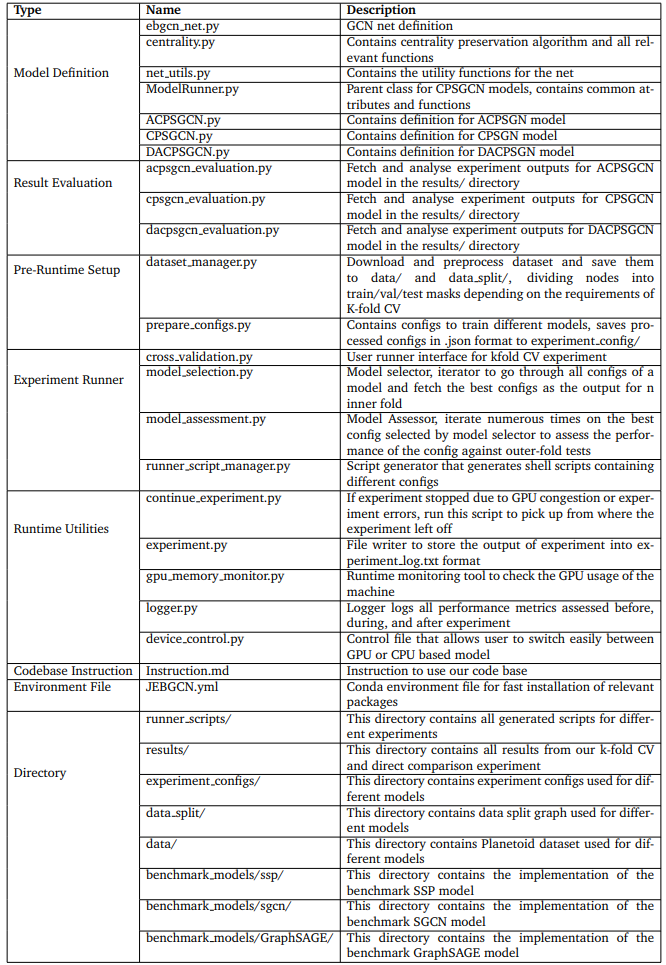

# Centrality Preserved Sparsifier Graph Convolutional Network (CPSGCN)
## Setup & Package Installation
Note that these instructions are written for Linux (Ubuntu 22.04 LTS) with NVIDIA driver version 525.125.06.

**1.** To setup the main directory, user is recommended to create a new Python 3.7.7 virtual environment using [conda](https://conda.io/projects/conda/en/latest/index.html "Conda Homepage").

**2.** Install NVIDIA CUDA 11.8 toolkit from [here](https://developer.nvidia.com/cuda-11-8-0-download-archive "cudatoolkit Homepage"). Depending on the user's NVIDIA driver version, different version of CUDA toolkit might be necessary.

**3.** Install packages for running experiment by typing the following in the terminal/command prompt:


```
$ conda env create -f CPSGCN.yml
```

This command will read the .yml file and install all the specified packages into a new Conda environment (in this case CPSGCN_env).

Activate the newly created environment: After the environment is created, you can activate it using the following command:


```
$ conda activate CPSGCN_env
```

**4.** Add the newly installed CUDA toolkit directory to conda environment by adding executing these lines in terminal/command prompt:

```python
# for CUDA Toolkit 11.8
$ conda env config vars set LD_LIBRARY_PATH=/usr/local/cuda-11.8/lib64
$ conda env config vars set PATH="/usr/local/cuda-11.8/bin:$PATH"
```
where user can check if these variables are defined by
```
$ conda deactivate
$ conda activate CPSGCN_env
$ conda env config vars list
```

Now the user is ready to execute our implementation & all benchmarks involved

## Executing Benchmarks
### Preparing Dataset
Cora and CiteSeer datasets are used in our experiment, to preprocess the dataset, splitting train/val/test masks for the dataset by execute the following:
```
$ python dataset_manager.py --dataset Cora
$ python dataset_manager.py --dataset CiteSeer
```
By default, the dataset mask splitting is implemented for 5 outer fold and 2 inner fold cross validation. But if user wants different cross validation fold structure, the user can execute:
```
$ python dataset_manager.py --dataset Cora --outer_k 10 -- inner_k 2
```
The example above prepares datasets for a 10 outer fold and 2 inner fold cross validation.

The propocessed data mask splits are saved in the data_split/ directory and the source of the data are stored in the data/ directory

### Preparing Experiment Configs
Experiment benchmarks envolved in our experiment includs SSP, SGCN and GraphSAGE alongside our proposed CPSGCN and ACPSGCN method. To prepare experiment benchmarks for execution user need to execute:
```
$ python prepare_configs.py 
```

### Executing Main Benchmarks & CPSGCN, mACPSGCN, zACPSGCN, and DACPSGCN
#### K-fold CV
After preparations, to execute K-fold CV on different models, run:
```
$ pythoon cross_validation.py --dataset Cora --model CPSGCN
```
where dataset can be Cora or CiteSeer, 
available models ranges from CPSGCN, ACPSGCN, SSP, SGCN, and GraphSAGE

*Note that it can takes tens of hours or even days to run a full-on experiment evaluating a model on a dataset. (we were running our experiment with RTX 4080 + Ryzen Gen 7)

#### Direct Comparison
To run direct comparison (evaluating models using methods deployed in SSP) execute the model file directly with direct_comparison argument, e.g.
For CPSGCN model:
```
$ python CPSGCN.py --use_gpu --dataset Cora --centrality CC --direct_comparison
```
For mACPSGCN and zACPSGCN model:
```
$ python ACPSGCN.py --use_gpu --dataset Cora --centrality DC_BC_EC --ac_select minmax --direct_comparison
$ python ACPSGCN.py --use_gpu --dataset Cora --centrality DC_BC_EC --ac_select zscore --direct_comparison
```
For DACPSGCN model:
```
$ python DACPSGCN.py --use_gpu --dataset Cora --direct_comparison
```
For SSP model:
```
$ python benchmark_models/ssp/gcn.py --use_gpu --dataset Cora --direct_comparison
```
For SGCN model:
```
$ python benchmark_models/sgcn/sgcn.py --use_gpu --dataset Cora --direct_comparison
```
For GraphSAGE model:
```
$ python benchmark_models/GraphSAGE/GraphSAGE.py --use_gpu --dataset Cora --direct_comparison
```

### Parallel Execution
As it can take a long time to run experiments and sometimes the experiment can be interrupted due to various reasons. Hence, to allow the evaluation to continue even after interruption or to maximise parallel execution, we designed our code as follows:

First, run
```
$ python continue_experiment.py
```
Which will inspect the experiment results generated and update the experiment scripts.

Then go to runner_scripts/ directory and locate the scripts that corresponds to the experiment that the user is running. Continue the experiment by executing the shell script. For example:

```
$ ./Cora_CPSGCN.sh
```

Once all scripts related to that experiment is executed, run
```
$ python cross_validation --dataset Cora --model CPSGCN
```
again to collect analysis of the experiment result

### File Usages
Description of files used in our repo can be found below:



